# Adder-STA-Synthesis

[](https://en.wikipedia.org/wiki/Verilog)
[](https://yosyshq.net/yosys/)
[](https://github.com/The-OpenROAD-Project/OpenSTA)
[](https://skywater-pdk.readthedocs.io/)

## Project Overview

This project implements and compares Ripple Carry (RCA), Carry Lookahead (CLA), and Kogge-Stone (KSA) adders using an open-source ASIC flow, analyzing their area and timing trade-offs after synthesis and static timing analysis.

The primary goal of the project is to evaluate the trade-offs between **timing performance** and **silicon area** across these architectures. Understanding these trade-offs is essential in digital VLSI design, where selecting the appropriate adder architecture can significantly impact the performance and efficiency of larger arithmetic circuits.

Each adder was designed in **Verilog HDL**, synthesized using **Yosys** with the **Sky130 HD standard cell library**, and analyzed using **OpenSTA** for static timing analysis. OpenSTA reported a negative setup slack at the limiting clock period; therefore, the next higher clock period was selected as the minimum operating clock period. The synthesized netlists were also used to compare the relative area utilization of the three implementations.

This project demonstrates a complete and reproducible **RTL-to-STA workflow**, providing practical insight into how different adder architectures behave after synthesis and how architectural choices influence timing and area in an ASIC design flow.

---

## Table of Contents

- [Objectives](#objectives)
- [Tools & Technologies](#tools--technologies)
- [Repository Structure](#repository-structure)
- [Adder Architectures](#adder-architectures)
- [Methodology](#methodology)
- [Results](#results)
- [Timing Analysis](#timing-analysis)
- [How to Run](#how-to-run)
- [Conclusion](#conclusion)

---

## Objectives

- Design and implement **Ripple Carry Adder (RCA)**, **Carry Lookahead Adder (CLA)**, and **Kogge-Stone Adder (KSA)** using **Verilog HDL**.
- Synthesize each design using **Yosys** with the **Sky130 HD standard cell library**.
- Perform **Static Timing Analysis (STA)** using **OpenSTA** under consistent timing constraints.
- Compare the synthesized designs based on **area utilization** and **timing performance**.
- Determine the **minimum clock period** (based on the critical path delay, setup time requirement, and applied timing constraints) at which timing is satisfied in OpenSTA, and use it to estimate the **maximum operating frequency** of each design.
- Demonstrate a reproducible **open-source RTL-to-STA ASIC design workflow**.

---

## Tools & Technologies

| Category | Tool / Technology |
|----------|-------------------|
| Hardware Description Language (HDL) | Verilog HDL |
| Simulation | Icarus Verilog |
| Waveform Visualization | GTKWave |
| Logic Synthesis | Yosys |
| Static Timing Analysis (STA) | OpenSTA |
| Standard Cell Library | Sky130 HD Standard Cell Library |
| Timing Constraints | Synopsys Design Constraints (SDC) |
| Operating System | Ubuntu Linux |
| Version Control | Git & GitHub |

---

## Repository Structure

```text
Adder-STA-Synthesis/
├── rtl/               # Verilog RTL implementations
├── testbench/         # Testbenches for functional verification
├── synthesis/         # Yosys synthesis TCL scripts
├── constraints/       # SDC timing constraint files
├── netlists/          # Synthesized gate-level netlists
├── sta/               # OpenSTA timing analysis TCL scripts
├── simulation/        # Simulation outputs and waveform files
├── docs/              # Reports, images, and documentation
├── .gitignore
└── README.md
```

Each directory is organized to separate RTL design, synthesis, timing analysis, simulation, and documentation, making the project easy to navigate and reproduce.

---

## Adder Architectures 

### Ripple Carry Adder (RCA)

### Description

The **Ripple Carry Adder (RCA)** is the simplest binary adder architecture, built by connecting multiple **Full Adders (FAs)** in series. Each full adder adds one bit of the input operands along with the carry from the previous stage. Due to this sequential carry propagation, the architecture is referred to as a *Ripple Carry Adder*.

### Working Principle

Each full adder generates a **sum** and a **carry** output. The carry produced at one stage becomes the input carry for the next stage, causing the carry to ripple through all bits before the final result is obtained. As the number of bits increases, the propagation delay increases linearly.

### Architecture Diagram

<p align="center">
  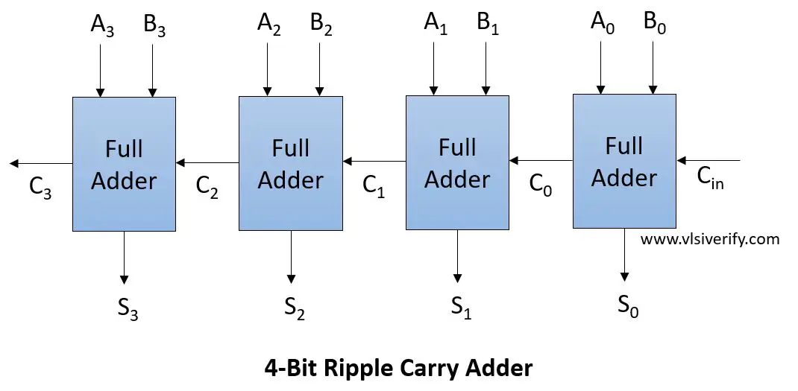
</p>

### Advantages

- Simple and easy to implement
- Low hardware complexity and area
- Suitable for small bit-width designs

### Limitations

- High propagation delay due to sequential carry generation
- Performance decreases with increasing bit width

### Theoretical Characteristics

| Characteristic | Value |
|---------------|-------|
| Carry Propagation | Sequential |
| Delay Trend | O(n) |
| Area Trend | Low |
| Speed | Low |


## Carry Lookahead Adder (CLA)

### Description

The **Carry Lookahead Adder (CLA)** improves addition speed by reducing the delay caused by sequential carry propagation. Instead of waiting for each carry to ripple through the stages, it computes carry signals in advance using **Generate (G)** and **Propagate (P)** logic.

### Working Principle

For each bit, the CLA determines whether a carry will be **generated** or **propagated**. Using these signals, the carry outputs for multiple stages are calculated in parallel, significantly reducing the overall propagation delay compared to a Ripple Carry Adder.

### Architecture Diagram

<p align="center">
  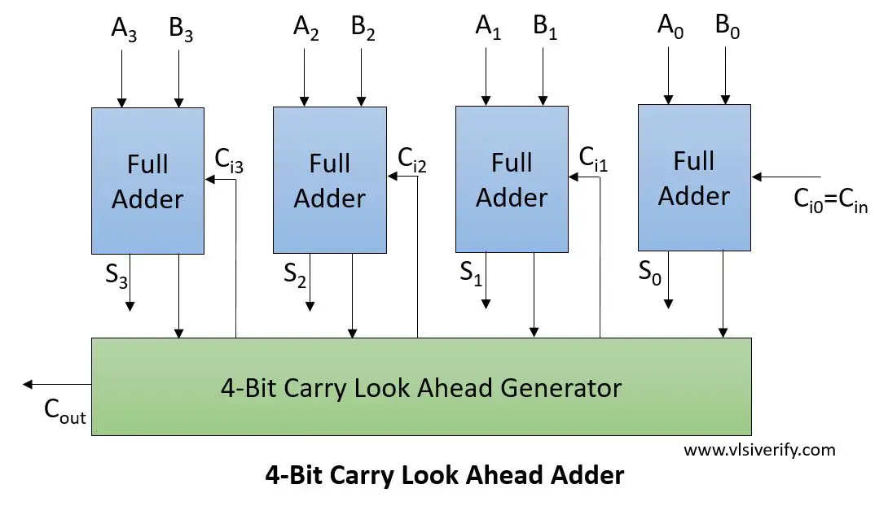
</p>

### Advantages

- Faster than Ripple Carry Adder
- Parallel carry computation reduces delay
- Suitable for medium to high-speed arithmetic circuits

### Limitations

- More hardware and logic complexity than RCA
- Area increases due to additional carry generation circuitry

### Theoretical Characteristics

| Characteristic | Value |
|---------------|-------|
| Carry Propagation | Parallel (Lookahead) |
| Delay Trend | O(log n) |
| Area Trend | Medium |
| Speed | High |

## Kogge-Stone Adder (KSA)

### Description

The **Kogge-Stone Adder (KSA)** is a high-performance **parallel prefix adder** designed to achieve very fast binary addition. It computes carry signals in parallel using a prefix tree structure, making it one of the fastest adder architectures for large bit-width operations.

### Working Principle

The KSA first computes **Generate (G)** and **Propagate (P)** signals for each bit. These signals are then combined through multiple levels of parallel prefix logic to determine all carry values simultaneously. This significantly reduces carry propagation delay compared to RCA and CLA.

### Architecture Diagram

<p align="center">
  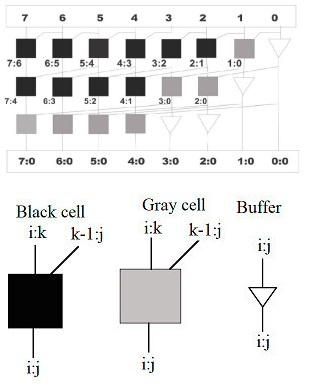
</p>

### Advantages

- Very high-speed carry computation
- Low propagation delay for large bit-width adders
- Well suited for high-performance processors and ASICs

### Limitations

- High hardware complexity and routing overhead
- Larger silicon area and power consumption than RCA and CLA

### Theoretical Characteristics

| Characteristic | Value |
|---------------|-------|
| Carry Propagation | Parallel Prefix |
| Delay Trend | O(log n) |
| Area Trend | High |
| Speed | Very High |

---

## Methodology

The following workflow was used to evaluate and compare the three adder architectures:

### 1. RTL Design

- Implemented **Ripple Carry Adder (RCA)**, **Carry Lookahead Adder (CLA)**, and **Kogge-Stone Adder (KSA)** in **Verilog HDL**.

### 2. Functional Verification

- Verified the functionality of each design using dedicated Verilog testbenches.
- Simulated the designs using **Icarus Verilog** and analyzed generated waveforms using **GTKWave**.

### 3. Simulation Results

- Each adder implementation was functionally verified using dedicated Verilog testbenches
- Simulations were performed using **Icarus Verilog**, and the generated waveforms were inspected using **GTKWave** to verify correct addition and carry     propagation before synthesis.
  
### 4. Logic Synthesis

- Synthesized each design using **Yosys** with the **Sky130 HD standard cell library**.
- Generated gate-level netlists and collected synthesis statistics, including synthesized cell area.

### 5. Static Timing Analysis

- Performed **Static Timing Analysis (STA)** using **OpenSTA** with identical timing constraints for all three architectures.
- Evaluated both **setup and hold timing** using **Synopsys Design Constraints (SDC)**.
- Extracted the critical path delay of each synthesized design for timing evaluation.

### 6. Performance Evaluation

- Established a baseline timing constraint of **10 ns** for initial static timing analysis.
- Extracted the critical path delay reported by OpenSTA for each synthesized design.
- Using OpenSTA, the minimum clock period was identified by finding the first period after the negative setup slack point that achieved positive slack.
- Verified the calculated clock period in OpenSTA to ensure that the design satisfies the given timing constraints.
- Used the verified minimum clock period to calculate the maximum operating frequency of each architecture.

---

## Simulation Results 

## Results

### Performance Comparison

| Architecture | Area (µm²) | Minimum Clock Period (ns) | Maximum Frequency (MHz) |
|--------------|-----------:|--------------------------:|------------------------:|
| Ripple Carry Adder (RCA) | 220.2112 | 7.16 | 139.66 |
| Carry Lookahead Adder (CLA) | 247.7376 | 6.49 | 154.08 |
| Kogge-Stone Adder (KSA) | 456.6880 | 5.84 | 171.23 |

### Area Comparison Chart
<p align="center">
  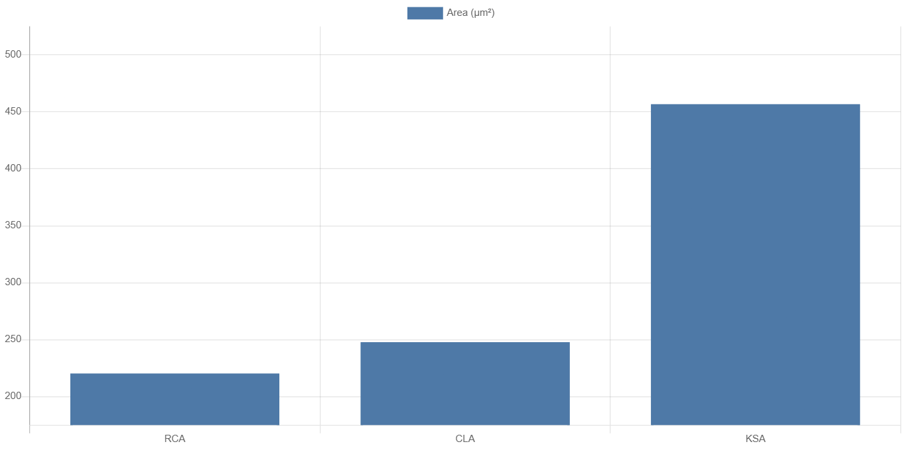
</p>

### Frequency Comparison Chart
<p align="center">
  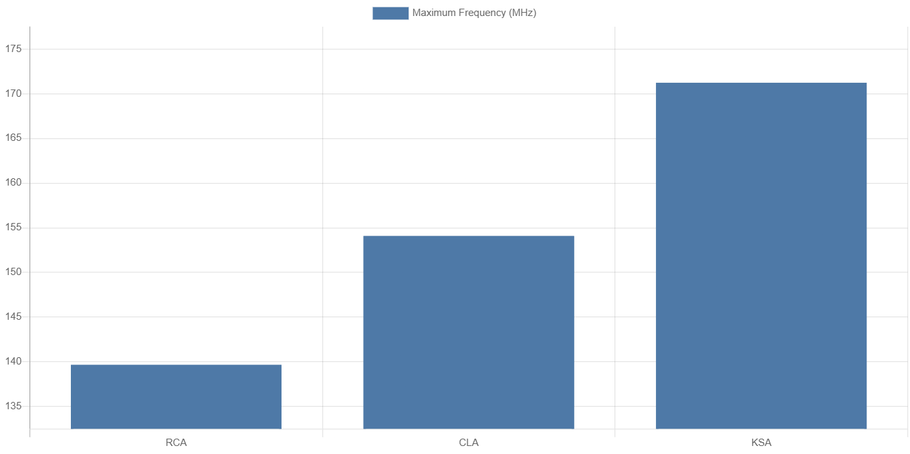
</p>

### Key Observations

- **Ripple Carry Adder (RCA)** achieved the smallest synthesized area due to its simple carry propagation structure. However, it showed the lowest timing performance because carry computation propagates sequentially through each stage.

- **Carry Lookahead Adder (CLA)** improved timing performance compared to RCA by reducing carry propagation delay using generate and propagate logic, with a moderate increase in synthesized area.

- **Kogge-Stone Adder (KSA)** achieved the highest operating frequency due to its parallel prefix architecture, but required significantly more area because of the additional logic required for carry computation.

- The maximum operating frequency of each architecture was determined by identifying the minimum clock period at which setup timing was satisfied under the applied STA constraints. The next lower clock period resulted in a small setup violation, confirming the timing boundary.

---

### Area Analysis

The synthesized area of each architecture was obtained from the Yosys synthesis statistics using the Sky130 HD standard cell library.

| Ripple Carry Adder (RCA) | Carry Lookahead Adder (CLA) | Kogge-Stone Adder (KSA) |
|---------------------------|-----------------------------|--------------------------|
| 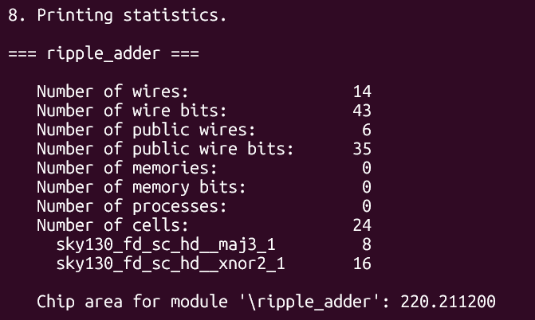 | 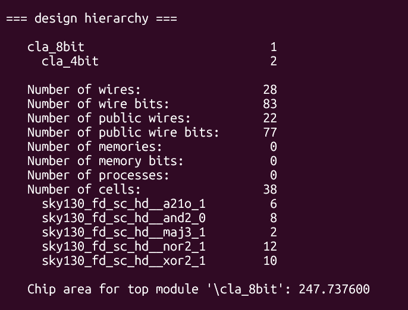 | 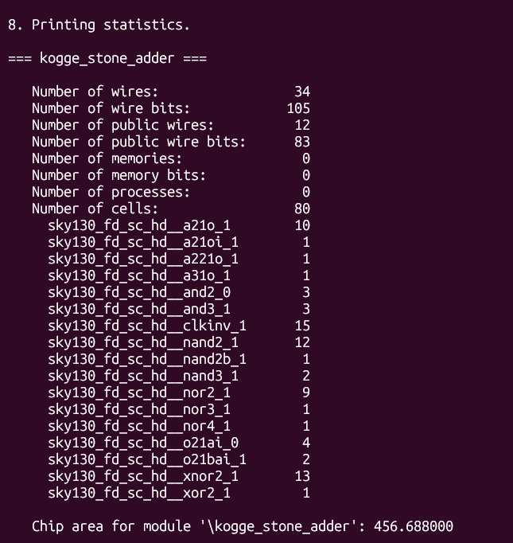 |
| *Figure 1. Yosys synthesis statistics for the Ripple Carry Adder.* | *Figure 2. Yosys synthesis statistics for the Carry Lookahead Adder.* | *Figure 3. Yosys synthesis statistics for the Kogge-Stone Adder.* |
---

## Timing Analysis

The setup timing reports below show the timing boundary where the design first fails (-0.01 ns slack). The reported minimum operating clock period is the next higher clock period at which timing is satisfied. Hold timing was verified at the selected operating clock period to ensure there were no hold violations.

| Parameter | Ripple Carry Adder (RCA) | Carry Lookahead Adder (CLA) | Kogge-Stone Adder (KSA) |
|-----------|---------------------------|------------------------------|--------------------------|
| **Setup Timing Boundary (Violation)** | 7.15 ns → Slack = -0.01 ns (**VIOLATED**) | 6.48 ns → Slack = -0.01 ns (**VIOLATED**) | 5.83 ns → Slack = -0.01 ns (**VIOLATED**) |
| **Minimum Operating Clock Period** | 7.16 ns (Timing met) | 6.49 ns (Timing met) | 5.84 ns (Timing met) |
| **Setup Timing Report** | 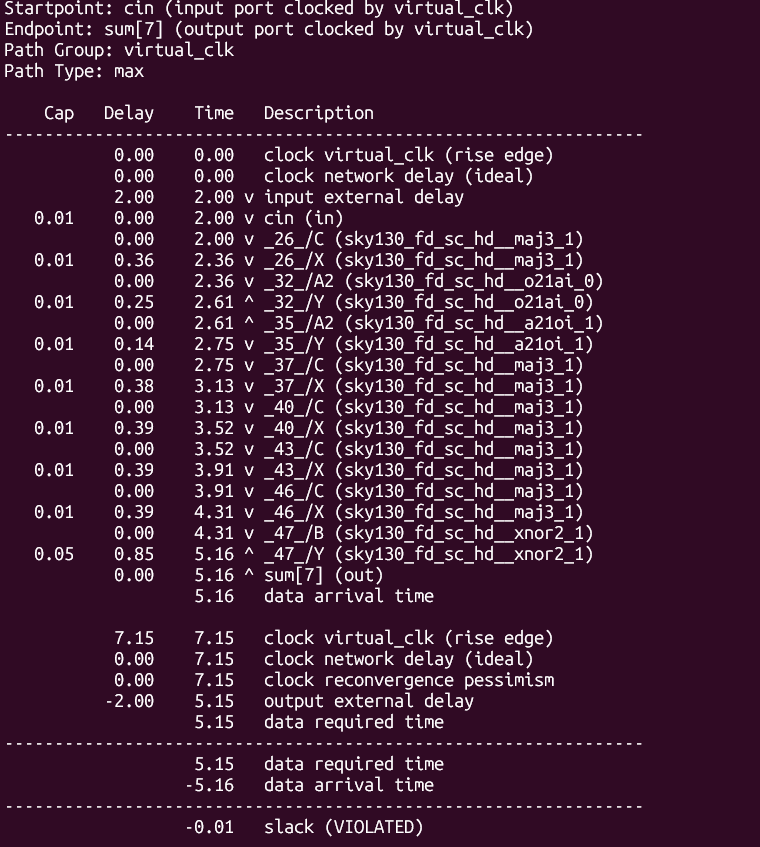 | 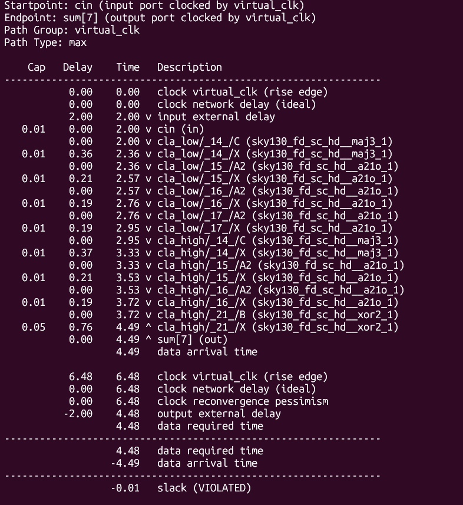 | 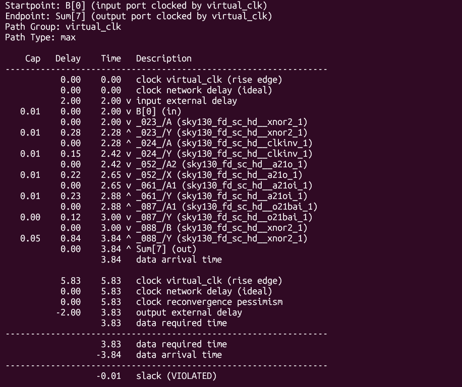 |
| **Hold Verification Clock Period** | 7.16 ns | 6.49 ns | 5.84 ns |
| **Hold Timing Result** | No hold violations observed | No hold violations observed | No hold violations observed |
| **Hold Timing Report** | 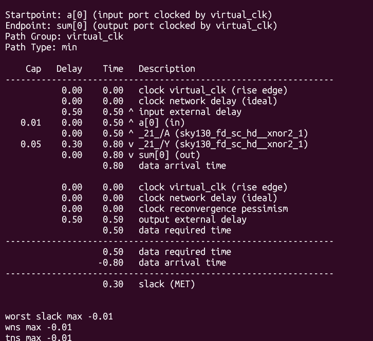 | 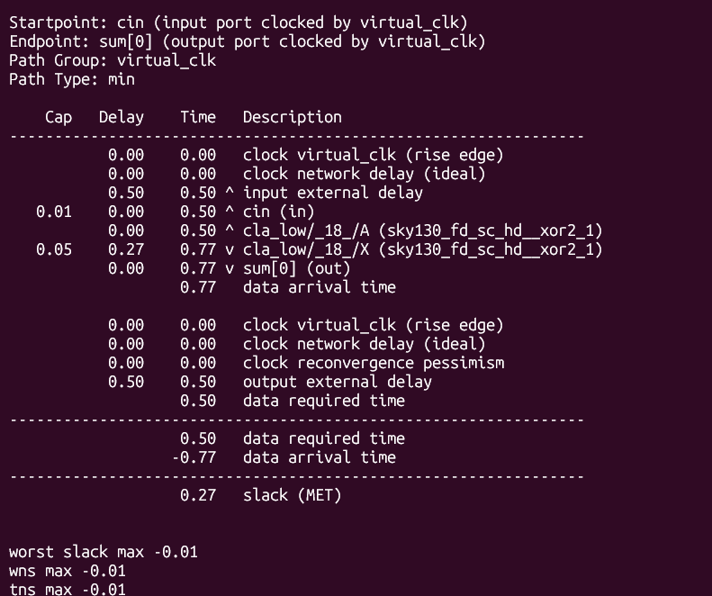 | 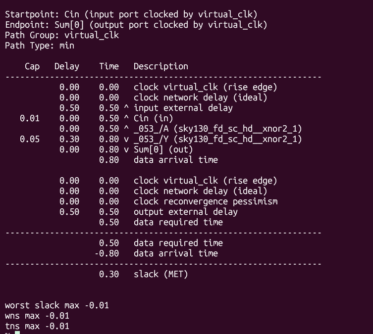 |

---

## How to Run

This section explains how to reproduce the synthesis and timing analysis results generated in this project.


### 1. Clone the Repository

First, clone the repository and move into the project directory:

```bash
git clone https://github.com/HandyLatcher/Adder-STA-Synthesis.git
cd Adder-STA-Synthesis
```

---

### 2. Update Required Paths

Before running the flow, update the paths inside the TCL scripts according to your local setup.

The main paths that may need modification are:

- **Sky130 HD standard cell library (`.lib`) location**
- **RTL source file locations**
- **Generated netlist paths**
- **Report output locations**

Make sure these paths correctly point to the files inside your cloned repository.

---

### Functional Simulation

The RTL designs are functionally verified using **Icarus Verilog**, and the generated waveforms are analyzed using **GTKWave**.

- `iverilog -o <output> <rtl_file> <testbench_file>` → Compiles the RTL design and testbench into a simulation executable.
- `./<simulation_file>` → Runs the compiled simulation and generates the waveform (`.vcd`) file.
- `gtkwave <waveform_file>.vcd` → Opens the waveform viewer to analyze signal transitions.

---

### Ripple Carry Adder (RCA)

```bash
iverilog -o rca_sim rtl/ripple_adder.v testbench/ripple_adder_tb.v
./rca_sim
gtkwave rca.vcd
```

### Carry Lookahead Adder (CLA)

```bash
iverilog -o cla_sim rtl/carry_lookahead_adder.v testbench/carry_lookahead_adder_tb.v 
./cla_sim
gtkwave cla.vcd
```

### Kogge-Stone Adder (KSA)

```bash
iverilog -o ksa_sim rtl/kogge_stone_adder.v testbench/kogge_stone_adder_tb.v
./ksa_sim
gtkwave ksa.vcd
```
---

### 4. Run Logic Synthesis Using Yosys

The synthesis scripts are located inside the `synthesis/` directory.

Navigate to the synthesis folder:

```bash
cd synthesis
```

Run Yosys with the required TCL script:

```bash
yosys -s <synthesis_script_name>.tcl
```

For example, to synthesize the Ripple Carry Adder:

```bash
yosys -s run_rca.tcl
```

Similarly, synthesis can be performed for the other architectures:

```bash
yosys -s run_cla.tcl
```

```bash
yosys -s run_ksa.tcl
```

After synthesis, Yosys generates the synthesized gate-level netlist and reports containing information such as:

- Number of synthesized cells
- Cell distribution
- Total synthesized area

The generated netlists are stored in:

```text
netlists/
```

---

### 5. Run Static Timing Analysis Using OpenSTA

OpenSTA is used to analyze the timing performance of the synthesized designs.

Since OpenSTA is executed from its own build directory, first navigate to the OpenSTA build location:

```bash
cd OpenSTA/build
```

Launch OpenSTA:

```bash
./sta
```

Inside the OpenSTA console, run the required timing analysis script.

Use the **absolute path of the repository** while sourcing the script so that OpenSTA loads the correct files from the cloned project.

For Ripple Carry Adder (RCA):

```tcl
source /home/<username>/Adder-STA-Synthesis/sta/run_sta_rca.tcl
```

For Carry Lookahead Adder (CLA):

```tcl
source /home/<username>/Adder-STA-Synthesis/sta/run_sta_cla.tcl
```

For Kogge-Stone Adder (KSA):

```tcl
source /home/<username>/Adder-STA-Synthesis/sta/run_sta_ksa.tcl
```

The STA scripts automatically load the synthesized netlist, timing constraints, and standard cell library to perform analysis.

The generated reports are used to evaluate:

- Setup timing
- Hold timing
- Critical path delay
- Slack values
- Timing constraint satisfaction

---

### 6. View Results

The important project files are organized as follows:

```text
Adder-STA-Synthesis/
│
├── rtl/             → Verilog RTL implementations
├── synthesis/       → Yosys synthesis scripts
├── netlists/        → Generated synthesized netlists
├── constraints/     → SDC timing constraint files
├── sta/             → OpenSTA timing analysis scripts
└── docs/            → Timing screenshots and documentation
```

Following these steps allows the complete RTL-to-STA flow to be reproduced using the same open-source ASIC design methodology used in this project.

---

## Conclusion

This project compares three commonly used adder architectures using an open-source RTL-to-STA design flow. By synthesizing each design with the Sky130 standard cell library and analyzing it using OpenSTA, the trade-off between area and timing performance can be clearly observed. While the Ripple Carry Adder provides the most area-efficient implementation, the Kogge-Stone Adder achieves the highest operating frequency at the cost of increased hardware complexity. The repository includes the required scripts and constraints to reproduce the synthesis and timing analysis results.
